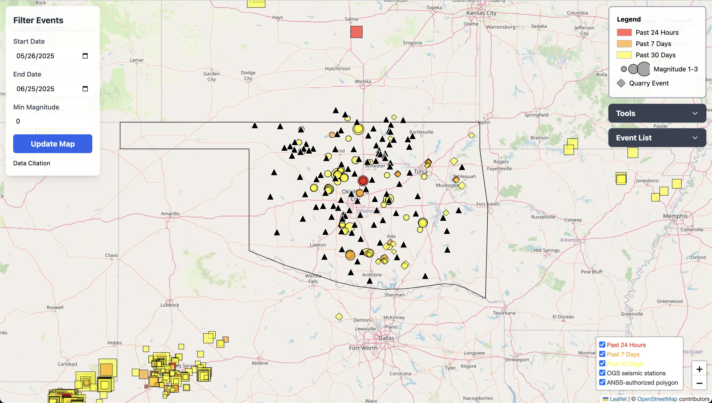

# Earthquake Map Project

A web application for visualizing Oklahoma and USGS earthquake data, plotting seismic stations, and exploring event details interactively.


---

## Features

- Interactive Leaflet map with Oklahoma polygon overlay
- Plots OGS and USGS earthquake events by age and magnitude
- Plots OGS seismic stations as black triangles
- Event list with popups and CSV download
- Box and cross-section selection tools
- Magnitude vs. Time and Depth Cross Section plots (Plotly)
- Data citation and attribution
- REST API (Flask) for OGS events and station metadata

---

## Project Structure

```
earthquake-map-project/
├── .gitignore
├── README.md
├── requirements.txt
├── config.example.json         # Template config (safe to commit)
├── config.json                 # (not tracked by git, user creates this)
├── earthquake_api.py           # Flask REST API backend
└── src/
    ├── index.html              # Main web app HTML
    ├── css/
    │   └── style.css           # (optional) Custom styles
    └── js/
        └── map.js              # Main JavaScript for map and UI
```

---

## Quick Start

### 1. Clone the repository

```bash
git clone https://github.com/yourusername/earthquake-map-project.git
cd earthquake-map-project
```

### 2. Install Python dependencies

```bash
pip install -r requirements.txt
```

### 3. Set up configuration

Copy the example config and fill in your database credentials:

```bash
cp config.example.json config.json
# Edit config.json with your DB credentials
```

**Never commit your real `config.json`!**

### 4. Run the Flask API

```bash
python earthquake_api.py
```

By default, the API will be available at `http://127.0.0.1:5000/api/earthquakes` and `http://127.0.0.1:5000/api/stations`.

### 5. Open the web app

Open `src/index.html` in your browser.  
If running on a server, configure your web server to serve the `src/` directory.


---

## API Endpoints for connecting with production postgresql

- `/api/earthquakes`  
  Query OGS earthquake events.  
  **Params:** `start`, `end`, `minmag`, `limit`

- `/api/stations`  
  Query OGS seismic stations (via IRIS).  
  **Params:** `lat`, `lon`, `maxradius`, `hours`

---

## License

[MIT License](LICENSE)

---

## Acknowledgments

- [Leaflet](https://leafletjs.com/)
- [Plotly.js](https://plotly.com/javascript/)
- [ObsPy](https://docs.obspy.org/)
- [USGS Earthquake API](https://earthquake.usgs.gov/fdsnws/event/1/)
- [IRIS FDSN Web Services](https://service.iris.edu/)

---

## Contributing

Pull requests and issues are welcome! Please open an issue for bugs or feature requests.

---

## Contact

For questions, contact [yourname@yourdomain.edu].
